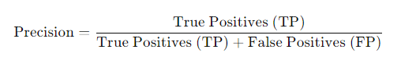
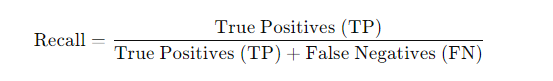
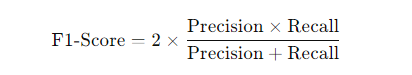

# SMS Spam Detection

This project demonstrates a machine learning approach to detecting spam messages using the Naive Bayes classification algorithm. The project is implemented in Python and uses the `sklearn` library for text processing and model building.

## Introduction
This project aims to classify SMS messages as either spam or ham (not spam). The dataset used for this project contains 5572 messages, with labels indicating whether the message is spam or ham. The model is built using a `Pipeline` that processes text data and applies the `MultinomialNB` classifier.

## Dataset
The dataset is available at [UCI Machine Learning Repository](https://archive.ics.uci.edu/ml/datasets/SMS+Spam+Collection). It contains two columns:
- `v1`: Label (spam or ham)
- `v2`: The SMS message

## Project Structure
- `spam_detection.py`: The main Python script containing the implementation.
- `spam_detection_model.pkl`: The saved model after training.
- `README.md`: Project documentation.

## Important Concepts

### Pipeline
A Pipeline in sklearn allows you to sequentially apply a list of transformations and a final estimator. It streamlines the workflow by automating the process of transforming data and making predictions. In this project, the pipeline consists of text vectorization and model fitting.

### CountVectorizer
CountVectorizer is used to convert text data into a matrix of token counts. It tokenizes the text, builds a vocabulary of known words, and encodes the documents as vectors. Each word in the dataset becomes a feature for model training.

### MultinomialNB
MultinomialNB is a Naive Bayes classifier suitable for classification with discrete features, such as word counts in text classification. It assumes that the features follow a multinomial distribution. This algorithm is widely used in spam detection due to its simplicity and effectiveness with text data.

### Classification Report
The classification_report function provides a detailed report showing the precision, recall, F1-score, and support for each class. This helps in understanding the performance of the model for both spam and ham classes.

Precision
Precision is the ratio of correctly predicted positive observations to the total predicted positives. It measures how many of the predicted spam messages were actually spam.

Formula:

A high precision indicates that the classifier returned more relevant results than irrelevant ones.

Recall (Sensitivity or True Positive Rate)
Recall is the ratio of correctly predicted positive observations to all actual positives. It measures how many of the actual spam messages were correctly identified.

Formula:

 
High recall indicates that the model successfully captured most of the relevant results.

F1-Score
The F1-score is the harmonic mean of precision and recall, combining them into a single metric. It balances the two metrics, especially when you need a measure that considers both precision and recall.

Formula:

 
The F1-score is useful when you want to seek a balance between precision and recall, particularly when dealing with an imbalanced dataset.

Support
Support refers to the number of actual occurrences of each class in the dataset. It provides context for understanding the precision, recall, and F1-score metrics, showing how many true instances of each class are present in the dataset.

